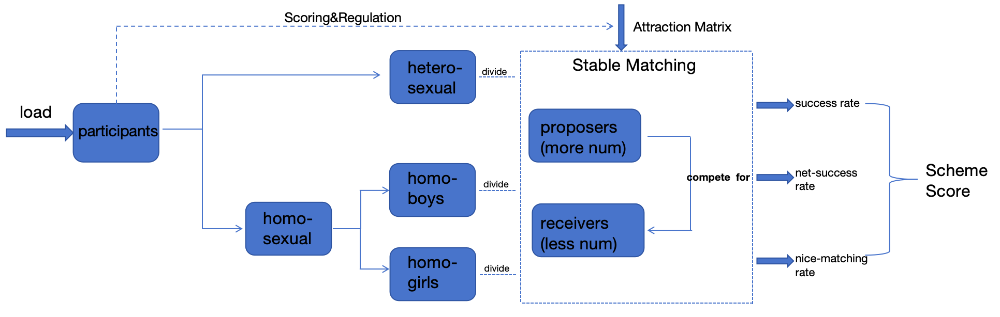
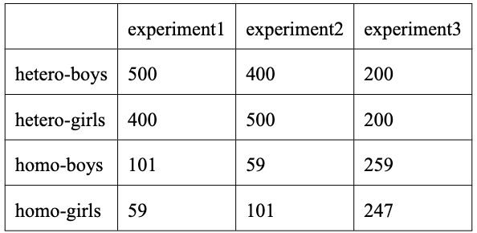

# One-Week-CP_Pairing

这是2023-2024-1 SJTU CS2309“问题求解与实践”的课程项目2（自选主题项目）
### Table of contents

- [序言](#序言)
- [项目简介](#项目简介)
- [问题描述与技术路线](#问题描述与技术路线)
- [实验](#实验)
- [致谢](#致谢)

### 序言

> 当我们选择伴侣时，在思考什么？
> 
> 即便我们深藏心底，也都心照不宣。
> 
> 回忆我们认识的人，谁"最"与我合适。
> 
> ZFC系统有选择公理，选择暗含顺序。
> 
> 即便我们不愿承认，”最“字暗含顺序。
>  
>  
>  
> 物语收集信息，为大家两两打分。
> 
> 以数学的优美，构造一种顺序。
> 
> 性别是否接受，年纪是否相当。
> 
> 兴致是否相投，性格是否相容。
> 
> 遥遥闵行徐汇，或是共饮中院热水。
> 
> 他乡偶遇故知，或是千里共聚鹊桥。
> 
> 以数学的严谨，描绘缘分的奇妙。
>  
>  
>  
> 当我们选择伴侣时，在思考什么？
> 
> 我们渴望情投意合，两情相悦。
> 
> 心中预先设定顺序，不过一厢情愿。
> 
> 相看两不厌，牵手靠配对。
>  
>  
>  
> 选择Gale-Shapley还是Edmonds？
> 
> 要金玉良缘还是要天作之合？
> 
> 博弈与运筹中，
> 
> 给出最优的匹配。

### 项目简介

该项目为自选主题任务。主要实现了 **“三日情侣”活动中，基于稳定匹配算法，根据参与者填写的问卷信息实现情侣配对**的功能。该项目有如下特点：

- **技术多元性**: 考虑到隐私保护与算法鲁棒性测试的需要，本项目利用 **Python脚本**生成大量、多组、多元的参与者信息；为契合课程要求，项目**核心代码均利用C++实现**，安装并利用**外部库nlohmann_json**实现C++中读取jsonl形式存储的参与者信息，符合项目 **“使用库编程”** 的要求；对于异性恋中男女不均的情况采用类似**贪心策略**的处理，对于同性恋参与者的匹配借助**遗传算法**进行配对策略的迭代与优化，符合项目 **“使用启发式算法”** 的要求；利用fltk库的基本GUI功能**手动实现**直方图和折线图绘制，进行**结果可视化**与分析，符合项目 **“利用FLTK进行图形界面编程”** 的要求，总代码量约1451行，符合**代码量500-1500左右”** 的要求
- **策略有效性**: 本项目中核心算法策略为二分图稳定匹配的Gale-Shapley算法，同时针对男女人数不平衡，同性恋参与者，参与者对某些指标的硬性要求，部分组合匹配度过低等情况添加了**分组配对、设定阈值、一票否决等策略机制**，在3组特征多元的测试集上，在 **“配对成功率”** ，**”净配对成功率“** **“优选率”** 三项指标上取得了良好的效果。同时对改进的Gale-Shapley算法进行理论分析，确保配对合理性和收敛性。
- **算法鲁棒性**: 同时通过对核心配对方法进行封装，对吸引力**分值标准化**，允许灵活调整分组模式、阈值与演化代数等方式，减小了不同参与者特征分布，打分偏好等对配对准确性的影响，增强程序的灵活性。项目发布之前生成多组测试集进行**算法测试、结果可视化和消融实验**，有效地验证了算法的鲁棒性。
- **场景实用性**:本项目基于**2023年11月、12月**公众号“交大十点物语”开展的两次高热度、高关注度的三日情侣/一周情侣活动，与活动主办方、算法负责人进行沟通与探讨，广泛吸收**两次活动中上海交大，华东师范大学一千余名活动参与者的反馈信息和校园论坛上的相关讨论意见**，完成算法的设计与实现，源于实践，解决真实的问题。

配对策略在多组数据集上的评测得分

### 问题描述与技术路线

#### 问题背景：

交大、华师大大学生普遍面临社交机会少，认识异性困难的”脱单难“问题。2023年11月，微信公众号”交大十点物语“发起”三日情侣“活动，交大、华师大同学可以通过填写问卷，提交个人信息与对另一半的期望（包含专业大类，家乡，学校与校区，MBTI，兴趣爱好等），活动运营方会采取配对算法匹配情侣开展活动。

但是，在本次活动中出现男多女少，筛选配对情侣困难，部分配对结果与性取向不一致，部分配对中核心诉求（如非异地）没有被满足等现象，导致活动满意度较低。

基于此，我希望开发一套优化的配对算法，该方法以stable matching为主要框架，并进行数据预处理，关键参数设定，目标函数调整等机制的完善，尽可能还原真实场景中的匹配并减少上述问题的出现。同时，算法主体用C++实现，显著提高程序运行效率，便于大规模数据的处理和计算。

事实上，类似的方法经过调整优化，还可以用于室友匹配，解决上海交通大学新生宿舍需求调研形同虚设的问题。

#### 技术路线：

##### 1.数据构造

考虑到隐私保护与算法鲁棒性测试的需要，本项目利用 **Python脚本**生成大量、多组、多元的参与者信息。本项目的特征设置基本参考[./scoring_details](./scoring_details)的物语活动问卷进行。对于家乡、性格、年龄等各个特征，问卷中都包含了自己特征以及期待对方的特征，便于后续打分。这里利用Python中随机数生成的功能，生成特征多样而随机分布的大量参与个体，以jsonl格式存储。

值得一提的是，在前期的活动中出现了参与者反馈某些他们更在意的特征，如校区、身高等没有满足的情况。这是由于之前的匹配采用最大权匹配的Edmonds算法，对各特征的匹配程度进行奖励/惩罚，得到吸引力分值，再根据总体最优的目标进行匹配，这就导致某些方面匹配而其他方面不匹配的参与者也可能被匹配到一起。考虑到不同参与者在意的对象特征有所差异，这里创造性地引入**significance score**向量，存储参与者对对方各特征的重视程度，每一个重视值为1-10的整数，如果填10则代表该特征是必须满足的条件，对不满足的对象会 **”一票否决“**；对其余重视程度，会反映在后续打分的过程中（也正因为”一票否决”的机制，我在生成测试数据时有意地控制了10分的特征的数量）。

##### 2.配对算法开发

该部分总体算法流程如图所示

算法流程框架图

**（1）数据读取** ：作为**C++库编程**的实践。安装并调用**外部库nlohmann_json**来读取以jsonl格式存储的数据构造过程中生成的每个人的数据，在C++程序中以Participant类的形式存储。

**（2）数据预处理**：该部分主要包括**计算吸引力矩阵**和**按性取向分组**两个过程

吸引力矩阵可以理解为两两之间吸引力的有权有向完全图的邻接矩阵。计算吸引力时，采取以下的奖惩策略，同时每项分值还要乘以重要性指数**double(significance_score[i])/10**。注意对于性取向或关键特征不符的情况，直接”一票否决“，记为0分。

为了消除不同参与者重要性指数打分习惯不同对吸引度计算的影响，对所得的分值再除以重要度向量的L2范数进行标准化。公式如下：

注意到由于每个人各有自己特征和理想型特征，所以一般情况下A对B的吸引力不等于B对A的吸引力，即吸引力矩阵是非对称矩阵。

打分细则

打分后，依据性别和性取向将参与者分为男异性恋、女异性恋、男同性恋、女同性恋四组。

**（3）算法主体：稳定匹配**
以异性恋为例。若男多于女，则男为proposer竞争女参与者。**利用二分图稳定匹配的Gale-Shapley算法的变体进行匹配**。未配对的proposer一轮轮地向receiver表白，若receiver未配对且proposer对其有足够吸引力，则接受；若已配对，比较现在配对对象与收到表白的发出者对receiver的吸引力大小来确定是否更改匹配对象。

与经典的GS算法的差异在于

1. 这里可以认为每个proposer都在receiver的list中，但是我在配对函数里设定了一定的阈值，彼此之间吸引力高于阈值才会配对成功。这样避免了匹配度过低的情况出现，提升了配对双方满意度。
2. 这里允许proposer人数大于receiver的情况的出现。在这种情况下，proposer会轮番表白直至每个proposer或配对完成，或对所有receiver都表白过一遍后再退出循环

  

Gale Shapley算法图示

对于同性恋，将男同/女同参与者均等分成两组（如果总数为奇数，则人数差1），然后执行上述算法。注意到GS算法是不对称的，稳定匹配是不唯一的，不同的分组方式可能影响结果，因此我采用**遗传算法**对分组方式进行进化与迭代，变异方式为染色体交叉，每次进化时随机选择一个操作数，或两组男同中交换一个元素，或两组女同交换一个元素，或上述二者均执行，然后重新配对，计算评价指标，保留更优解。在进化五十代后，算法稳定收敛，得到进化后的较优解。

  

遗传进化方法图示

  

进化代数与配对得分

**（4）评价指标**

本算法从三个角度衡量匹配策略的效果

**1. 匹配成功率(success rate)**：匹配成功的参与者占所有参与者比例

**2. 净匹配成功率（net success rate)**：匹配成功的参与者占至多匹配成功人数（剔除因男女不均衡导致一定不能配对成功的人数）的比例

**3. 优选率(nice matching rate)**：若成功配对的receiver是proposer的前30%的选择，则记为此proposer为优选，优选率为优选的proposer占至多成功匹配proposer（剔除因男女不均衡导致一定不能配对成功的人数）的比例。

最后得到一个匹配的总体打分:

### 实验

#### 1.改变参与者特征分布

生成如下的三组数据：

实验1setting

都取hetero threshold=1, homo threshold=0.7得到结果

实验1结果fltk可视化

可见算法针对不同情况有良好的效果和鲁棒性。

同时，**由于本项目核心算法以C++实现，运算效率很高**，能在10s内完成所有配对和演化运算。

#### 2.改变阈值

基于实验1中第一组数据（更符合交大—华师活动性别分布实况），进行改变阈值的分析，设定如下：

实验2setting

得到结果

实验2结果fltk可视化

取消阈值（即设为-100）的消融实验中，净配对率100%，优选率低，随着阈值的提高，配对率和净配对率降低，优选率提高，这与intuition非常吻合。

### 致谢

以上就是我项目2的主要内容，由于时间、精力和工具的限制，我没有完全实现我的想法，比如基于AI打分的颜值检验等。

感谢交大十点物语主办活动和各位参与者、建言者给本项目的启发；感谢活动的算法负责人HZX与我的分享与探讨。

感谢老师和助教的耐心审阅，以及一学期以来的陪伴和教诲。祝新年快乐，万事胜意！（也祝自己2024pairing success lol)
